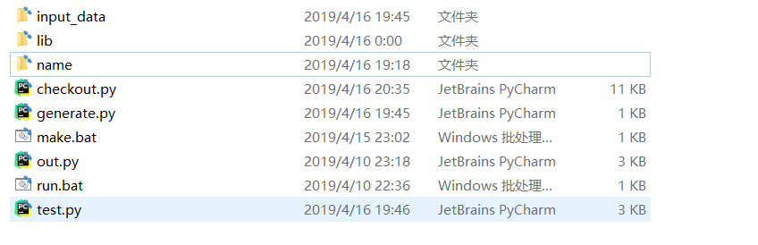

# 食用指南

## 文件结构

* `input_data`为输入文件夹
* `lib`放官方输入输出包
* `name`放编译好的`java`文件（命令行编译``javac -Djava.ext.dirs=./lib -sourcepath ./name -encoding utf-8 ./name/Main.java`

## generate

随机生成测试数据在`input_data`文件夹中

可以自定义程序中的生成文件数量，指令间隔时间范围，最晚指令时间等参数

## test

在生成输入之后运行，它会定时投放指令，并产生输出文件在对应文件夹下

要自定义你的`name`列表，以及产生的输入文件数目

## checkout

检查输出的正确性，如果有错误会在控制台输出，也会在对应目录下产生错误文件，这里我默认输出的时间间隔是对的（因为只要常数不写错好像间隔不会短于规定）

同样，要自定义你的`name`列表，以及检查的输出文件数目

## 问题

1. `test`在差不多测试100个点时有3,4个点会时间莫名错误，检查出时间错误最好验证一下
2. `checkout`情况太多很可能我没考虑完。。。